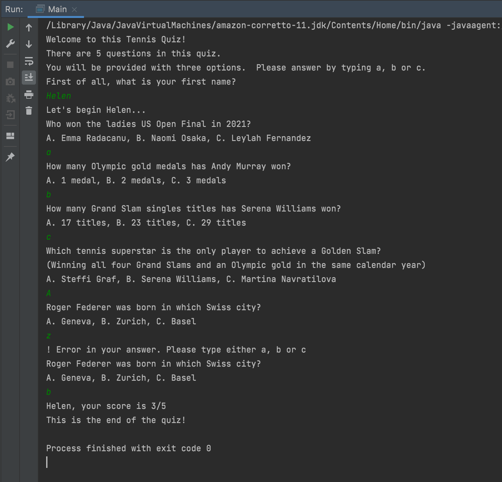

# GAMES QUIZ

### Overview
A Java based quiz game.

### 1. Project's objective
To learn Java in object orientated programming (OOP).

### 2. Design and layout
A quiz game with an introduction, questions & answers and providing the overall score to the player.

### 3. Technical development

#### 3.1 Technologies
- Java
- IDE IntelliJ

#### 3.2 Java
- Classes include Quiz, Player and QuestionsAnswers.  The quiz being the parent of the two other subclasses.
- The introduction asks for the players name and this answer is stored in the player's class.
- The questions are stored as an object in the QuestionsAnswers class. A while loop spits out each question.
- The player's answers either a, b or c.
  - If they answer A, B or C, this is turned into lowercase letters.  
  - For any other input, an error message appears and the question re-appears so they can try again.
  - The player's answers are stored in the Player's class.
- To get the score, the player's answers are checked against the real answers in the QuestionsAnswers class via a for loop.